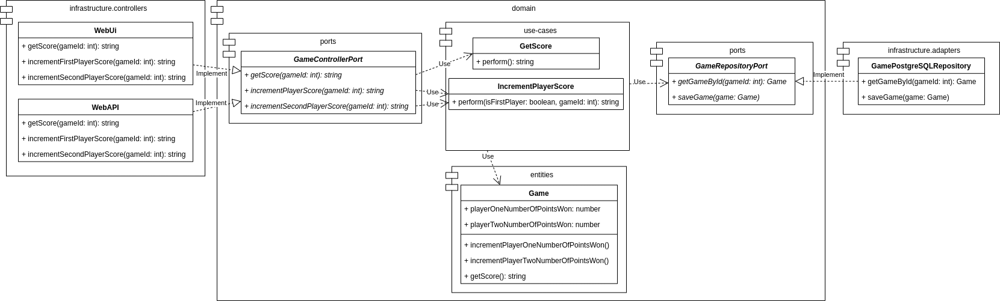

# Subject - The tennis game

You’ll need to implement an application to follow a tennis game score.

Tennis score rules are:
- Each player can have this scores (from lower to higher): 0, 15, 30 and 40
- If a player has 40 and win the point, he wins the game:
`player X won the game`
- If the two players have 40, the score is `deuce`
- If the score is deuce, the player who scored takes the advantage: 
`advantage for player X`
- If the player who has the advantage win the point, he wins the game:
`player X won the game`
- If the player who hasn’t the advantage win the point, we come back to a deuce score

You’ll need to implement all these rules on the existing source code structure.

# Before you start
## Used libraries

We use [jest](https://www.npmjs.com/package/jest) for the unit tests, 
[cucumber](https://www.npmjs.com/package/@cucumber/cucumber) for the behavior tests and
[inversifyJs](https://github.com/inversify/InversifyJS) for inversion of control.

## Requirements

Having Docker and Docker-compose installed!

Initialize the Docker environment by executing this: `make build`.

## Usage

You can run unit tests with `make run-unit`.

You can run behavior tests with `make run-behavior`.

## Application structure
### Description

The application is built following the Ports and Adapters architecture.

The domain (core) of the application is isolated from any infrastructure / dependencies.
Doing so, you can, for example:
- Link it a WebUI controller and a Rest API to persist data: it becomes a web app
- Link it an API framework and a PostgreSQL database: it becomes an API

During this workshop, we will focus on developing and testing the domain part.
The infrastructure needs dependencies and should be developed and tested later.

### Class diagram

### Sequence diagram of one use case: a player scores

# Let's go!

## 0. Discover the source code

First of all, take a look to the existing source code and discover how it works.

- [ ] 0.0. Look at controllers, the application's entry points
- [ ] 0.1. Look at the use cases, the application's orchestrators
- [ ] 0.2. Look at the entities which old the application's business rules and entities
- [ ] 0.3. Look at the ports which describe contract with outgoing dependencies
- [ ] 0.4. Look at the adapters which implement the contracts
- [ ] 0.5. Find the Gherkin scenarios (features)
- [ ] 0.6. Find the Gherkin steps parsing file

## 1. Run tests

- [ ] 1.0. Run the unit tests (they should work)
- [ ] 1.1. Run the behavior tests (spoiler alert: they should fail)

## 2. We don't test the adapters!

As said before, we should not test the adapters, and that's exactly why your test is
failing.

- [ ] 2.0. Found where the adapter is called
- [ ] 2.1. Found a way to not call the adapter while keeping the same code logic in 
this function
- [ ] 2.2. Do it! (tips on
[how to do this with InversifyJS](https://github.com/inversify/InversifyJS/blob/master/wiki/container_snapshots.md)
with the help of [hooks in Cucumber](https://github.com/cucumber/cucumber-js/blob/HEAD/docs/support_files/hooks.md))

## 3. Your first scenario <3

Now that you have all your scenarios working, you can write the next one.
You can test the second tennis game rule: 
> If a player has 40 and win the point, he wins the game:
`player X won the game`

- [ ] 3.0. Write the scenario in the `.feature` file
- [ ] 3.1. Write missing steps in the steps parsing file until the tests run failed and 
no more steps are undefined (tips on 
[defining steps](https://github.com/cucumber/cucumber-js/blob/HEAD/docs/support_files/step_definitions.md))
- [ ] 3.2. Make the test pass by implementing missing source code. Don't forget to
use Test-Driven Development cycles ;)

## 4. Don't stop me now!

Write scenarios for other tennis game rules, and make every test green!
But don't forget the TDD and BDD cycles ;) 
